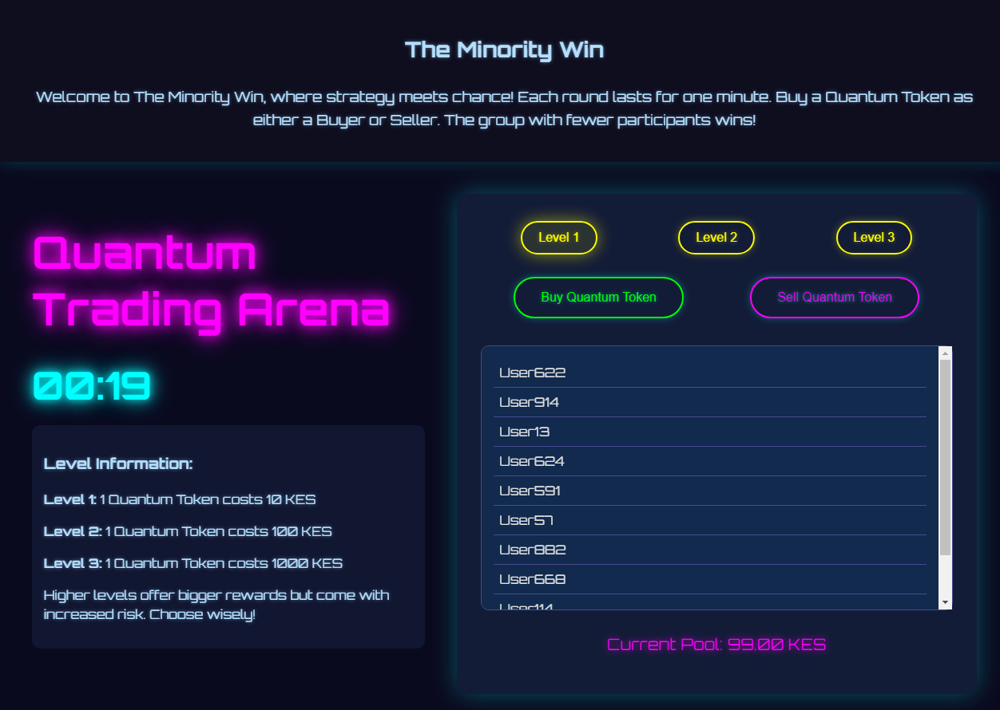
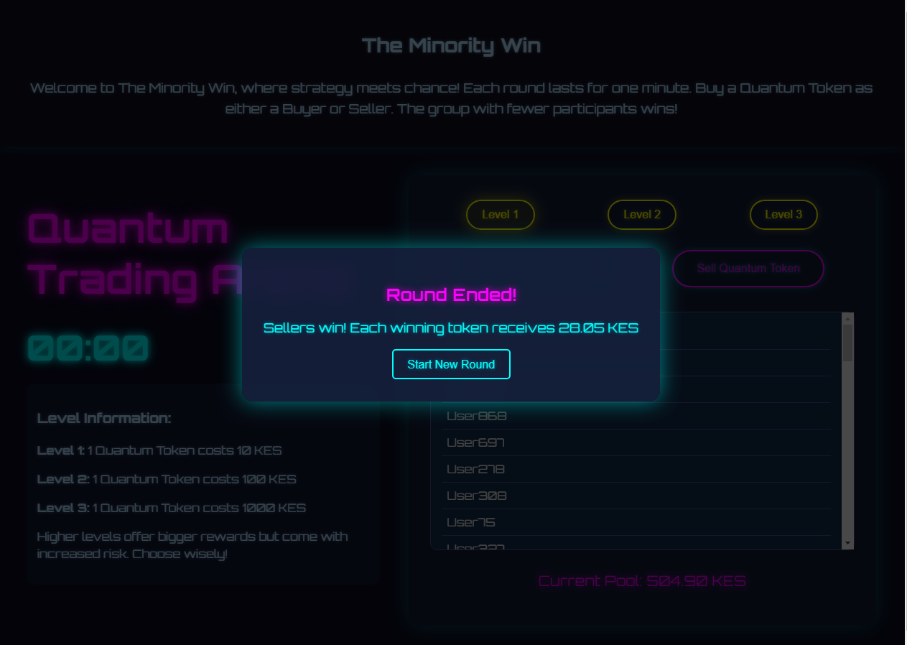

minority win is a simple game where users can buy or sell a quantum token 
if you buy you are added to the sellers pool and buyers to the buyers pool
when the current round ends, it is supposed to run for 60 seconds, the money in the pool is divided by half 
sellers split equaly and buyers too 
so the group with the least members gets bigger shares each depending on the total money in the pool

###Screen shots

